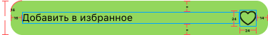

#  Задача 10 | Детали спецпредложения – UI кнопки избранного

[⬅️ назад](../README.md)

## ТЗ

Необходмио реализовать UI кнопки избранного на экране деталей оффера.

### Макет

Изображение сердца: 
* UIImage(systemName: "heart") – не в избранном
* UIImage(systemName: "heart.fill") – в избранном

**Формат текста**

"Добавить в избранное"
* Шрифт: System
* Вес: Regular
* Размер: 14

### Эталон

## Ожидаемое решение

Необходимо реализовать `FavoriteLargeButton` в соответсвии с макетом
