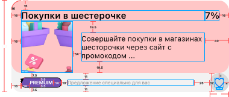
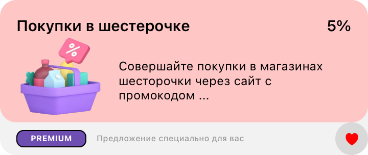
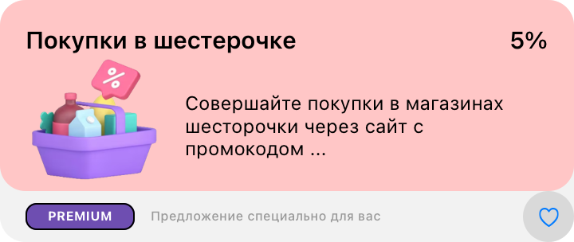

#  Задача 7 | Список спецпредложений – UI

[⬅️ назад](../README.md)

## ТЗ

Необходмио реализовать UI ячейки офферов.

### Макет

Изображение сердца: 
* UIImage(systemName: "heart") – не в избранном [tintColor = .tintColor]
* UIImage(systemName: "heart.fill") – в избранном [tintColor = .red]

**Формат текста**

"Покупки..." + "7%"
* Шрифт: System
* Вес: Semibold
* Размер: 15

"Совершайте покупки.."
* Шрифт: System
* Вес: Regular
* Размер: 12

"PREMIUM"
* Шрифт: System
* Вес: Bold
* Размер: 8

"Предложение специально.."
* Шрифт: System
* Вес: Medium
* Размер: 8
* Цвет: 9A9A9A

! Важно. Нужно учесть, что капсула с названием подписки и подпись справа от нее скрывается, если нет данных

### Эталон

## Ожидаемое решение

Необходимо реализовать `SpecialOfferView` в соответсвии с макетом
