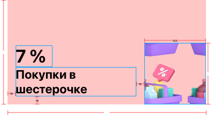

#  Задача 8 | Детали спецпредложения – UI шапки

[⬅️ назад](../README.md)

## ТЗ

Необходмио реализовать UI хэдера экрана деталей офферов.

### Макет

**Формат текста**

"7%"
* Шрифт: System
* Вес: Bold
* Размер: 36

"Покупки..."
* Шрифт: System
* Вес: Bold
* Размер: 24

### Эталон

## Ожидаемое решение

- Необходимо реализовать `OfferHeaderView` в соответсвии с макетом
