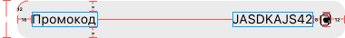
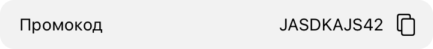

#  Задача 9 | Детали спецпредложения – UI секции промокода

[⬅️ назад](../README.md)

## ТЗ

Необходмио реализовать UI секции с промокодом.

### Макет

Изображение: UIImage(systemName: "rectangle.portrait.on.rectangle.portrait")

**Формат текста**

"Промокод"
* Шрифт: System
* Вес: Regular
* Размер: 14

"JASDKAJS42"
* Шрифт: System
* Вес: Regular
* Размер: 14

### Эталон

## Ожидаемое решение

Необходимо реализовать `PromocodeView` в соответсвии с макетом
